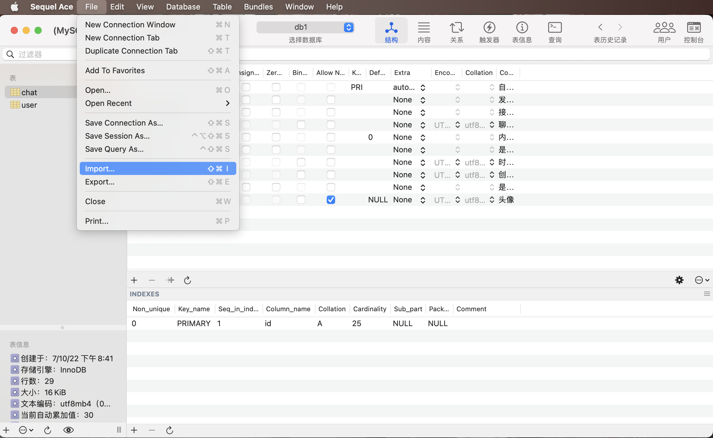
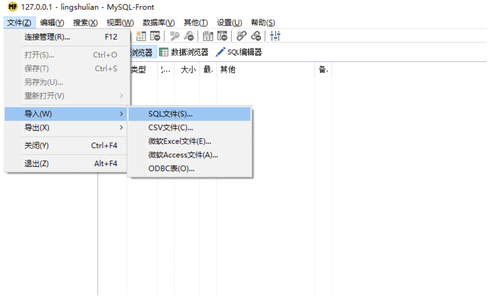
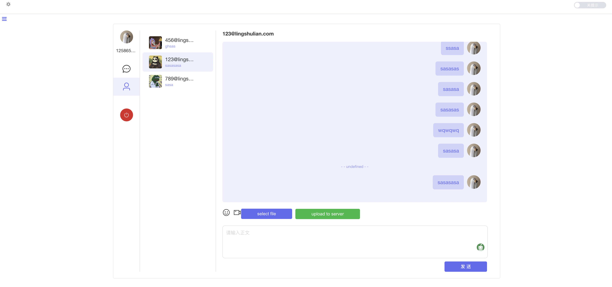

socket-chat 使用说明

首先离要求还是有一段距离的，能力有限

前端框架上主要是利用vue3+element-plus+socket.io 开发，主要是通过element-plus小组件进行了图片上传操作，并且按照需求提供了API接口调用。

问题在于打分系统，我没有开发出来，我不太清楚具体是什么形式来实现。

在后端上采取的是 nodejs+socket.io,由于我是改的代码，原来代码上继承了数据库mysql，其中在chat-service 下的file.js 还保留了s3 对象存储的功能（为了保证代码可读性，我没有删除该部分）

### 技术栈

| 前端         | 描述                                   | 学习网站                                                     |
| ------------ | -------------------------------------- | ------------------------------------------------------------ |
| Vue3         | 渐进式 JavaScript 框架                 | [https://v3.cn.vuejs.org/](https://v3.cn.vuejs.org/)         |
| TypeScript   | JavaScript 的一个超集                  | [https://www.tslang.cn/](https://www.tslang.cn/)             |
| Vite         | 前端开发与构建工具                     | [https://cn.vitejs.dev/](https://cn.vitejs.dev/)             |
| Element Plus | 基于 Vue 3，面向设计师和开发者的组件库 | [https://element-plus.gitee.io/zh-CN/](https://element-plus.gitee.io/zh-CN/) |
| Pinia        | 新一代状态管理工具                     | [https://pinia.vuejs.org/](https://pinia.vuejs.org/)         |
| Vue Router   | Vue.js 的官方路由                      | [https://router.vuejs.org/zh/](https://router.vuejs.org/zh/) |
| Uno css      | 即时按需原子 CSS 引擎                  | https://github.com/unocss/unocss](https://github.com/unocss/unocss) |

| 后端      | 描述                                                         | 学习网站                                                     |
| --------- | ------------------------------------------------------------ | :----------------------------------------------------------- |
| express   | 基于 [Node.js](https://nodejs.org/zh-cn/) 平台，快速、开放、极简的 Web 开发框架 | [https://www.expressjs.com.cn/](https://www.expressjs.com.cn/) |
| socket.io | 支持及时、双向与基于事件的交流                               | [https://socket.io/](https://socket.io/)                     |

### 环境准备

- 服务端：node.js（版本建议：>= v14.17.3）、兼容s3的对象存储（用于存储图片、视频等文件）（原来代码有这个功能可以灵活控制）
- web端：node.js（版本建议：>= v14.17.3）
- 数据库：mysql（版本建议：>= v8.0，可导入sql文件即可）

### 基本目录

```
vue3-socket-chat     
├──chat-client    // web端项目
├──chat-service   // 服务端项目
├──chat-db        // 数据库
```

chat-client

在该代码主要是支持发送图片、视频、token权限登录，响应式聊天页面，对于发送图片的代码在chatFoot.vue 文件内，其中我主要做了一些小的修改。我引入了element-plus库。其中在action调用了mocky测试API，理论上可以自行替换。详情请参考element-plus官方文档。

```html
      </div>
        <el-upload
        ref="uploadRef"
        class="upload-demo"
        action="https://run.mocky.io/v3/9d059bf9-4660-45f2-925d-ce80ad6c4d15"
        :auto-upload="false"
         >
        <template #trigger>
        <el-button type="primary">select file</el-button>
        </template>
```

chat-db

#### 数据库

这里我们使用的是 `MySQL Front` 导入数据表，具体可根据您的使用习惯来导入相应数据表

- 创建并连接好数据库

  需要mysql指令创建数据库，或者用一些软件直接UI化创建。

- 导入用户表

- 此处我以我自己mac为例，mysql版本8.0.29  Sequel Ace 软件 

  

此处import 导入数据表

导入用户表

选择 `vue3-socket-chat/chat-db/user.sql`导入即可

导入聊天记录表

选择 `vue3-socket-chat/chat-db/chat.sql`导入即可

数据库导入完在前端面上创建账号会有一个报错，具体的没有截图，但是那个原因我没记错是跟md5加密方式有关，记得不是那么清楚了，好像是跟mysql8 严格加密模式有关，要改掉这个模式。

下面给一个Windows的页面



进入MySQL Front 选择 `文件 -> 导入 ->SQL文件  `

导入用户表

选择 `vue3-socket-chat/chat-db/user.sql`导入即可

导入聊天记录表

选择 `vue3-socket-chat/chat-db/chat.sql`导入即可

启动web端

- 进入web端目录

```bash
cd vue3-socket-chat/chat-client
```

- 安装依赖

```bash
npm install
```

- 运行项目

```bash
npm run dev
```

- 打包项目（动态表情占14M多，代码体积不到1M)

```bash
npm run build
```

#### 

启动服务端

- 进入服务端项目

```bash
cd vue3-socket-chat/chat-service
```

- 安装依赖

```bash
npm install
```

- 配置数据库

进入 `vue3-socket-chat/chat-service/config.js` 进行如下配置

```javascript
  // 数据库配置
  dbConfig: {
      host: "127.0.0.1",
      port:3306,
      user: "root", // 数据库登录用户
      password: '123456', // 数据库登录密码
      database: "xxx" // 数据库名称
  },

```

配置对象存储（应该有其他方式可以规避）

我用的是棱束链对象存储

https://www.lingshulian.com

1. 创建存储桶 - [官方教程](https://www.lingshulian.com/help-document?d_id=fbf3eba4ef5ac21d42cf86447044c961)

2. 获取 `secretId` 和 `secretKey`

   - 创建好存储桶后，登录 [棱束链个人中心](https://console.lingshulian.com/user-center)，打开 **功能设置** 区域的 `API开启状态`，即可获得密钥

3. 获取 `地域` 和 `端点`

   登录 [棱束链存储桶列表](https://console.lingshulian.com/bucket-list)，点击目标存储桶右侧的 `配置` 按钮，即可在桶配置页的桶信息区域获得相应桶的 `地域` 和 `端点`

   

   启动服务

   ```shell
   node app.js
   ```

   

### 测试

打开浏览器输入 http://localhost:3000 即可，以下提供几个默认测试账号

- 账号：123@lingshulian.com，密码：123456
- 账号：456@lingshulian.com，密码：123456
- 账号：789@lingshulian.com，密码：123456

### 浏览器支持

本地开发推荐使用 `Chrome 80+` 浏览器

支持现代浏览器, 不支持 IE

**页面一览**



**说明**

该代码主要基础还是建立在别人代码基础之上，编程经验不多，上传到GitHub具体要遵守什么形式和规则还是不是很清楚。请多指教。# VQA-chatui
# VQA-chatui
